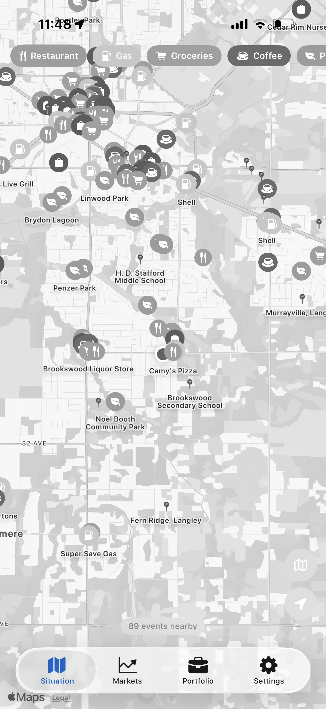
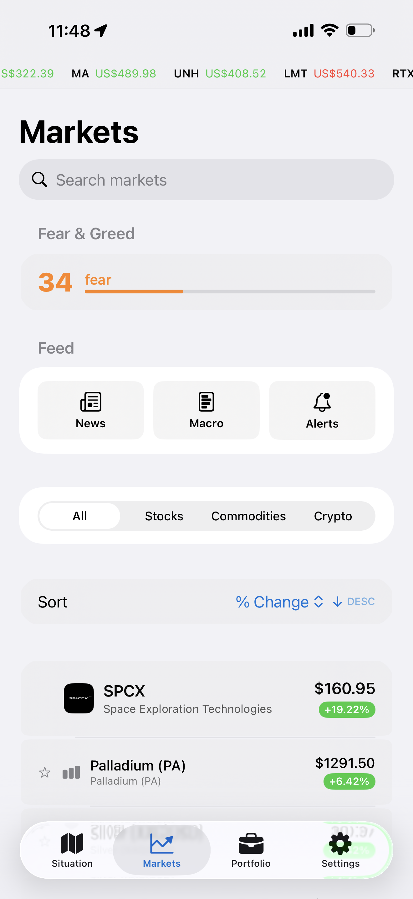
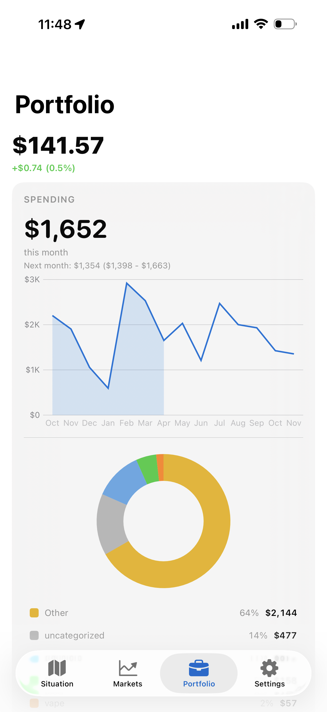

# Epiphany.
    

Personal intelligence platform. Map, markets, and people. Palantir for regular people.

[Live](https://epiphany.heyitsmejosh.com) | [Architecture](architecture.svg) | [Whitepaper](WHITEPAPER.md) | [Roadmap](ROADMAP.md)

## Tabs

| Tab | Status |
|---|---|
| Situation | Live map + daily brief + situation monitor + macro pulse |
| Markets | Unified sort/filter, search icon, Fear & Greed banner, news drawer |
| Stocks | Detail view with charts, indicators, Buy/Sell trading, news |
| Portfolio | Holdings, budgets, debt payoff, spending analysis |
| Settings | Theme, ticker, account, brokerage, autopilot |

## Screenshots

| Situation | Markets | Stocks |
|---|---|---|
|  |  |  |
| Live map with 12 toggleable layers: flights, earthquakes, weather, wildfires, crime, incidents, emergency services, dispatch, news, events, predictions, heatmap | Simplified stock list with Fear & Greed banner, News drawer, Sort & Filter panel | Stock detail with price, chart, indicators (SMA, EMA), Buy/Sell buttons, news |

| Portfolio | Settings |
|---|---|
|  |  |
| Holdings, cash, spending by category with history chart, debt payoff projections | Account, brokerage sync (Wealthsimple), Autopilot trading (BETA), security |

## Features

- **Live Map** with 12 toggleable layers: flights (live + dead-reckoning animation), earthquakes, weather, wildfires, news, incidents, emergency services (fire stations, hospitals, ambulances), dispatch (police/fire/EMS), crime, local events, predictions, heatmap. **Two layers stub-ready, pending API keys:** gas prices + restaurants — see [Roadmap](ROADMAP.md#api-keys-needed).
- **Daily Brief** morning summary on the Situation tab: top movers (Yahoo crumb path) + market headlines. Always has content.
- **Macro Pulse** live strip: GDP, CPI, fed rate, yields, VIX, fear/greed (FRED)
- **Markets** live stock data (Yahoo Finance crumb + FMP), bid/ask/exchange in detail view, 1m/15m/max timeframes, anomaly detection
- **Indicators + Signal** RSI, MACD, Bollinger Bands, SMA/EMA/WMA, Stochastic, ATR, plus a Buy/Hold/Sell badge on every stock from a composite of RSI + MACD + MA trend
- **Trading Simulator** 60fps canvas sim with Kelly criterion, edge detection, P&L tracking
- **Portfolio** holdings, debt payoff projections, spending by category, Statements view
- **Prediction Markets** Polymarket with whale tracking and order flow
- **Knowledge Graph** 9 object types, 6 relationship types (Ontology tab)
- **Command Bar** Cmd+K universal search
- **Auth + Billing** Free and Premium ($1/wk via Stripe) tiers — Stripe code wired, price ID pending
- **Landing Page** animated node-graph hero, scrolling ticker, feature/pricing sections
- **PWA** offline service worker
- **Companions** iOS (v1.5.0), macOS, watchOS

## Run

```bash
npm install
npm run dev
npm test -- --run
npm run build
```

Deploy: Vercel (`cd apps/epiphany && npx vercel --prod`)

## Beta testing — what to check

- Log into your brokerage (Settings → Brokerage), confirm it shows your broker name
- Sync your portfolio — holdings, cash, no duplicates, no $0 values
- Check the Autopilot feature
- Check the stocks list — verify no bugs (prices, sparklines, detail view)
- Check maps, events, and data layers
- Report anything broken: github.com/nulljosh/epiphany/issues

## License

MIT 2026, Joshua Trommel

## Shipped

Map with 11 live layers, coordinate validation, layer toggles. Live ticker with
static fallback. Stocks via Yahoo crumb path (marketCap and P/E authenticated with
cookie + crumb), full indicator suite plus Buy/Hold/Sell signal badge. Daily brief
rewired off FMP onto the working quote path so it always has content. Macro pulse
from FRED. Polymarket whale tracking. Read-only SnapTrade brokerage sync with
per-position holdings. STALE data indicator. Stripe Free/Premium gate (code complete). Landing page,
PWA, avatar sync across web and native. Palantir-style icon on all platforms.
Monica to Epiphany rename across web, iOS, macOS, watchOS. **Markets UI redesign:**
unified sort/filter panel (asset type + metric + order), search icon in header, Fear & Greed
full-width banner below ticker, news drawer for daily brief on both platforms, login/register
pages now display logo.

Open items live in [ROADMAP.md](ROADMAP.md).
