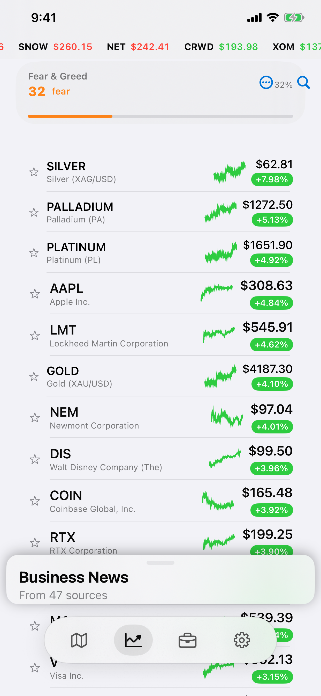
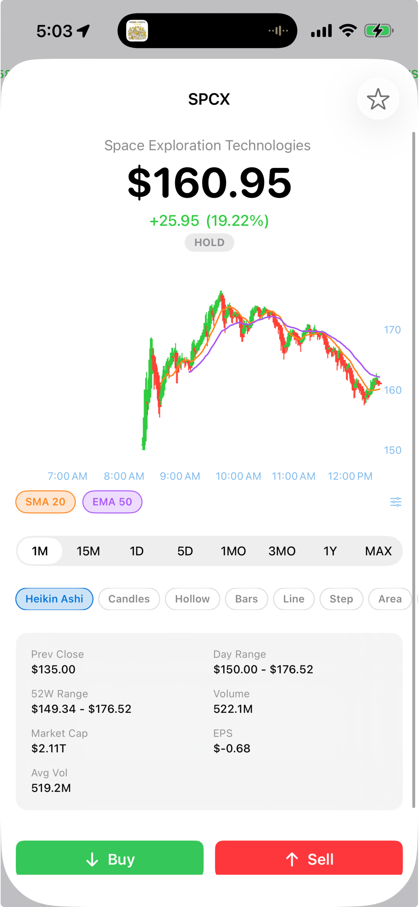
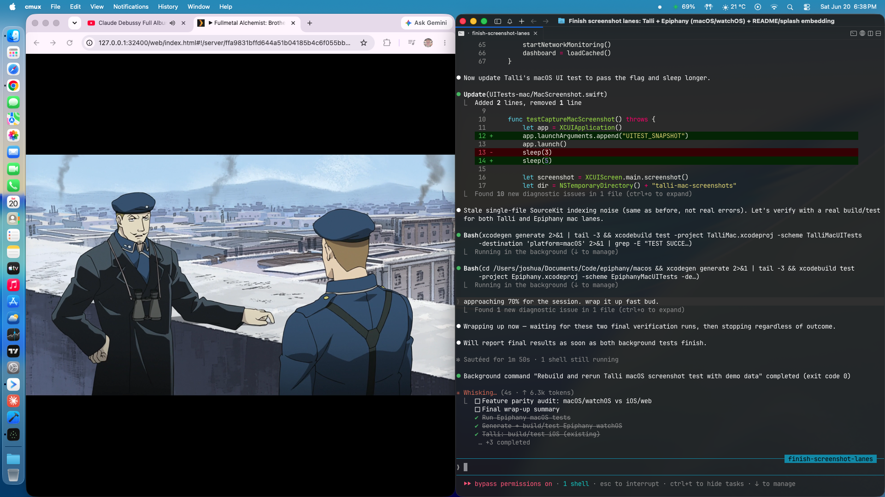
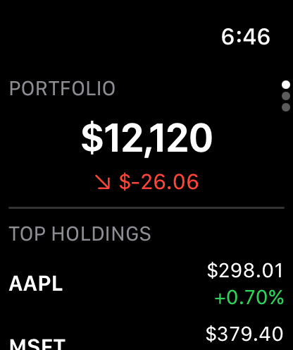

# Epiphany.
      

Personal intelligence platform. Map, markets, and people. Palantir for regular people.

[Live](https://epiphany.heyitsmejosh.com) | [App Store](https://apps.apple.com/app/epiphany/id6779522175) | [Architecture](architecture.svg) | [Whitepaper](WHITEPAPER.md)

  
  
  

  
  

## Tabs

| Tab | Status |
|---|---|
| Situation | Live map + daily brief + situation monitor + macro pulse |
| Markets | Stocks, crypto, commodities, fear/greed, Polymarket whales |
| Simulator | 60fps trading simulator with Kelly criterion and edge detection |
| Portfolio | Holdings, budgets, debt payoff, spending analysis |
| People | Search and index with relationship graph |
| Settings | Theme, ticker, account, billing |

## Features

- **Live Map** — 11 live data layers: flights, earthquakes, weather, wildfires, news, incidents, emergency services, dispatch, crime, local events, predictions
- **Daily Brief** — morning summary on Situation tab with top movers + headlines
- **Macro Pulse** — live strip: GDP, CPI, fed rate, yields, VIX, fear/greed
- **Markets** — live stock data, bid/ask/exchange detail, 1m/15m/max timeframes, anomaly detection
- **Indicators + Signal** — RSI, MACD, Bollinger Bands, SMAs, Stochastic, ATR, Buy/Hold/Sell badge
- **Trading Simulator** — 60fps canvas with Kelly criterion and edge detection
- **Portfolio** — holdings, debt payoff projections, spending analysis
- **Prediction Markets** — Polymarket with whale tracking
- **Knowledge Graph** — 9 object types, 6 relationship types
- **Command Bar** — Cmd+K universal search
- **Auth + Billing** — Free and Premium ($1/wk via Stripe)
- **Landing Page** — animated node-graph hero, scrolling ticker, feature/pricing sections
- **PWA** — offline service worker
- **Native** — iOS, macOS, watchOS companions

## Weekend Roadmap

- [ ] Watch first live Autopilot BTC probe fill (capped at 3 fractional trades, auto-reverts to paper)
- [ ] Per-stock news drawer on `StockDetailView` (same drag pattern as Markets, scoped to that stock's news)
- [ ] News-not-loading investigation (`fetchNews()` / backend news endpoint)
- [ ] Statement upload UI bug — button doesn't persist the file (manual KV workaround used once, root cause still open)
- [ ] Mom/dad debt amounts — update to $300/$350/$200 in Budget editor
- [ ] App Store submission checklist (screenshots, privacy questionnaire, demo account, build green)

See [ROADMAP.md](ROADMAP.md) for the full backlog.

## Setup

See [CLAUDE.md](CLAUDE.md) for dev, test, and build commands.

Deploy: Vercel (`npx vercel --prod`)

## Known issues / next session
- macOS + watchOS screenshot automation confirmed working (fastlane `mac_screenshots` lane, real app UI captured).

## License

MIT 2026, Joshua Trommel
