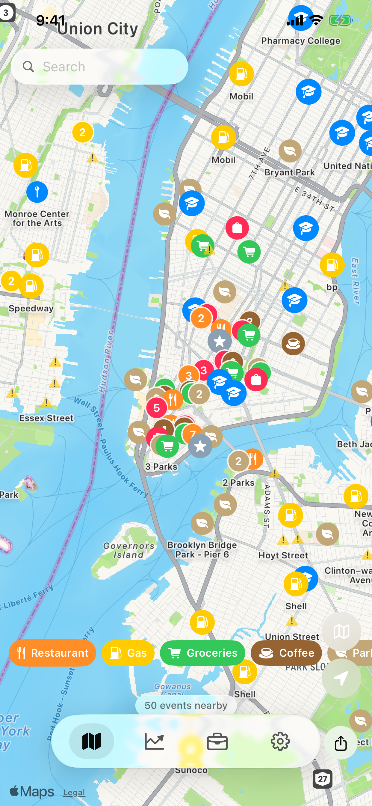
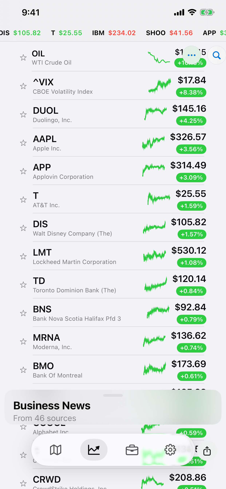
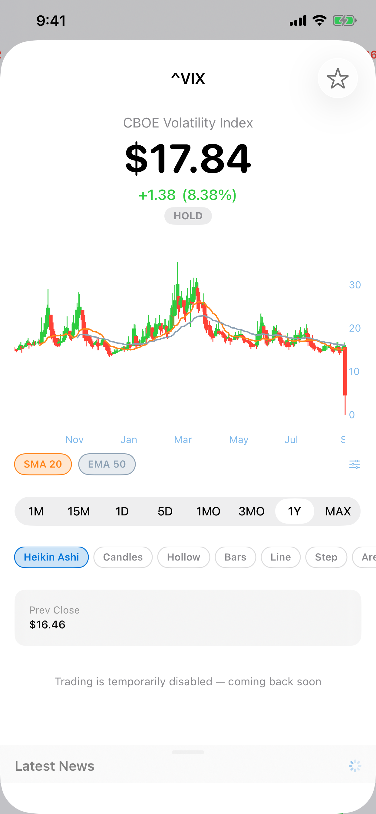
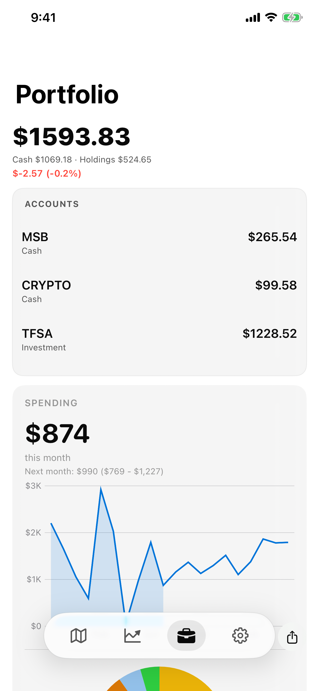
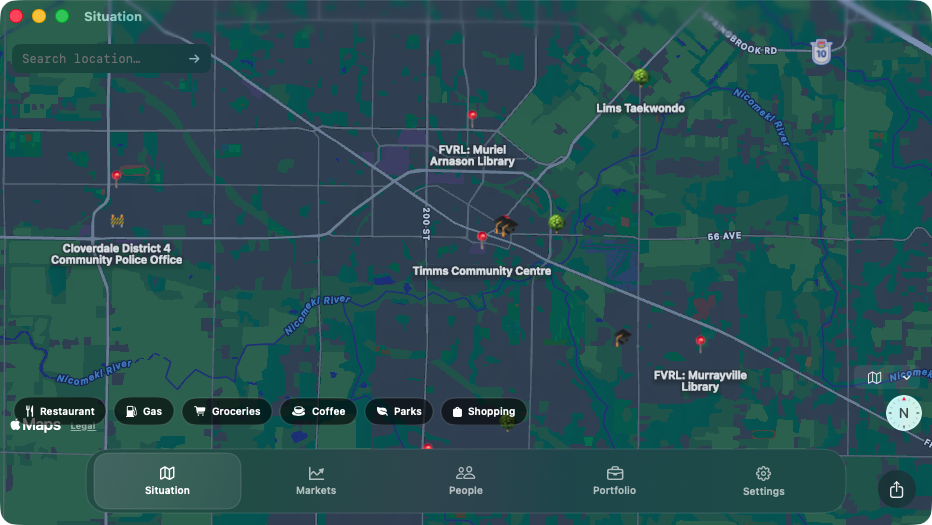
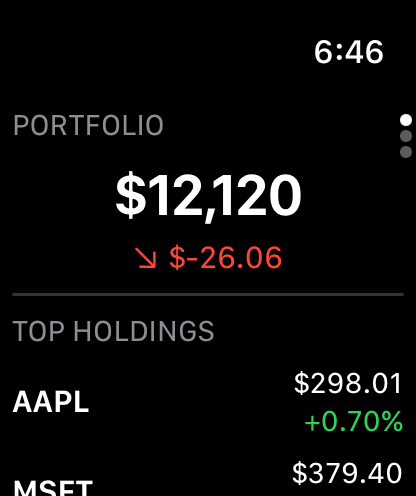

# Epiphany.
[](https://epiphany.heyitsmejosh.com) [](https://apps.apple.com/app/epiphany/id6779522175) [](https://apps.apple.com/app/epiphany/id6779522175) [](https://apps.apple.com/app/epiphany/id6779522175) [](https://apps.apple.com/app/epiphany/id6779522175) [](LICENSE) [](https://github.com/nulljosh/epiphany) [](.claude/skills/epiphany/SKILL.md)

Personal intelligence platform. Map, markets, and people. Palantir for regular people.

[Live](https://epiphany.heyitsmejosh.com) | [App Store](https://apps.apple.com/app/epiphany/id6779522175) | [Architecture](architecture.svg) | [Whitepaper](WHITEPAPER.md)

<p align="center">
  
  
  
  
</p>

<p align="center">
  
  
</p>

## Claude Skill

[`.claude/skills/epiphany`](.claude/skills/epiphany/SKILL.md) — admin access to your Epiphany portfolio data (holdings, debt, budget) directly in Upstash KV via Claude Code, no app login needed:

```bash
scripts/kv-portfolio-edit.sh get <email>            # dump current portfolio JSON
scripts/kv-portfolio-edit.sh set <email> <file.json> # overwrite with merged JSON
```

## Tabs

| Tab | Status |
|---|---|
| Situation | Live map + daily brief + situation monitor + macro pulse |
| Markets | Stocks, crypto, commodities, fear/greed, Polymarket whales |
| Simulator | 60fps trading simulator with Kelly criterion and edge detection |
| Portfolio | Holdings, budgets, spending analysis |
| People | Search and index with relationship graph |
| Settings | Theme, ticker, account, billing |

## Features

- **Live Map** — 11 live data layers: flights, earthquakes, weather, wildfires, news, incidents, emergency services, dispatch, crime, local events, predictions
- **Daily Brief** — morning summary on Situation tab with top movers + headlines
- **Macro Pulse** — live strip: GDP, CPI, fed rate, yields, VIX, fear/greed
- **Markets** — live stock data, bid/ask/exchange detail, 1m/15m/max timeframes, anomaly detection
- **Indicators + Signal** — RSI, MACD, Bollinger Bands, SMAs, Stochastic, ATR, Buy/Hold/Sell badge
- **Trading Simulator** — 60fps canvas with Kelly criterion and edge detection
- **Portfolio** — holdings, net worth, spending analysis
- **Prediction Markets** — Polymarket with whale tracking
- **Knowledge Graph** — 9 object types, 6 relationship types
- **Command Bar** — Cmd+K universal search
- **Auth + Billing** — Free and Premium ($1/wk via Stripe)
- **Landing Page** — animated node-graph hero, scrolling ticker, feature/pricing sections
- **PWA** — offline service worker
- **Native** — iOS, macOS, watchOS companions

Roadmap: [ROADMAP.md](ROADMAP.md).

## Setup

See [CLAUDE.md](CLAUDE.md) for dev, test, and build commands.

### Terminal dashboard

`npm run tui -- <email>` — live-refreshing portfolio TUI (ink), reads directly from Upstash KV, no login needed.

Deploy: Vercel (`npx vercel --prod`)

## License

MIT 2026, Joshua Trommel

## API and agent tools

[`docs/API.md`](docs/API.md) documents the HTTP surface (where there is one) and
the WebMCP tools this app registers on `document.modelContext`, so an in-browser
agent can drive it. Tools are split into read-only, reversible writes, and the
few that require human confirmation.
