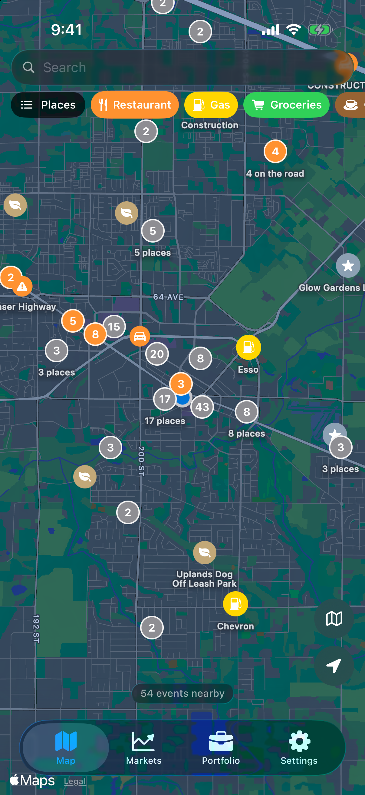
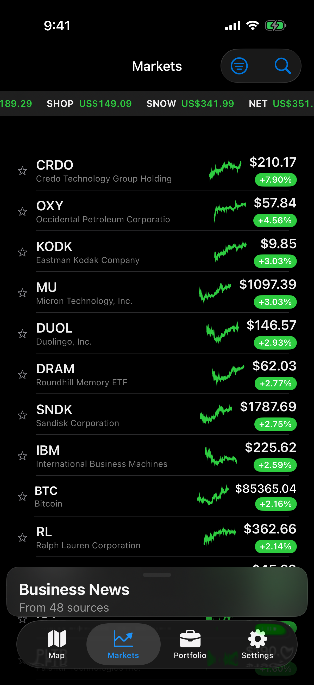
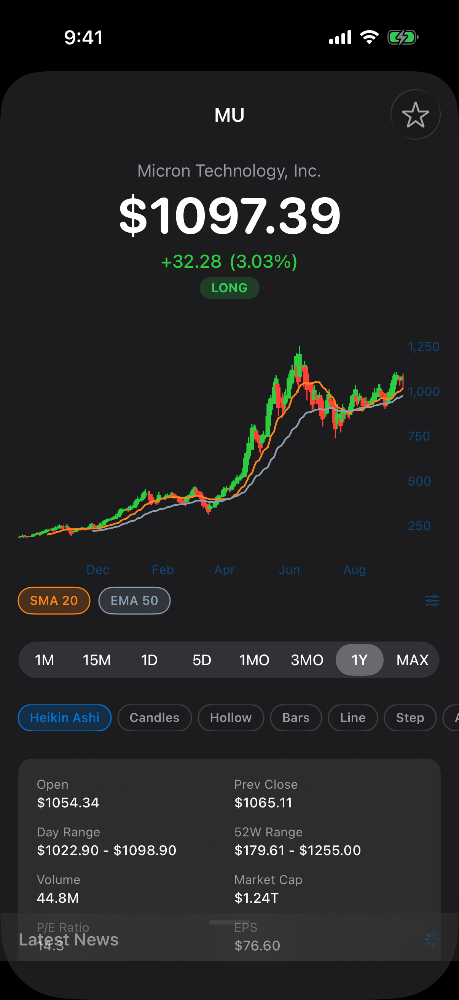
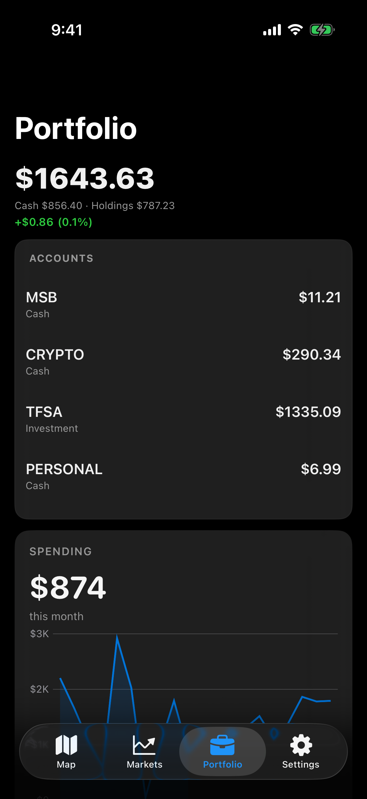
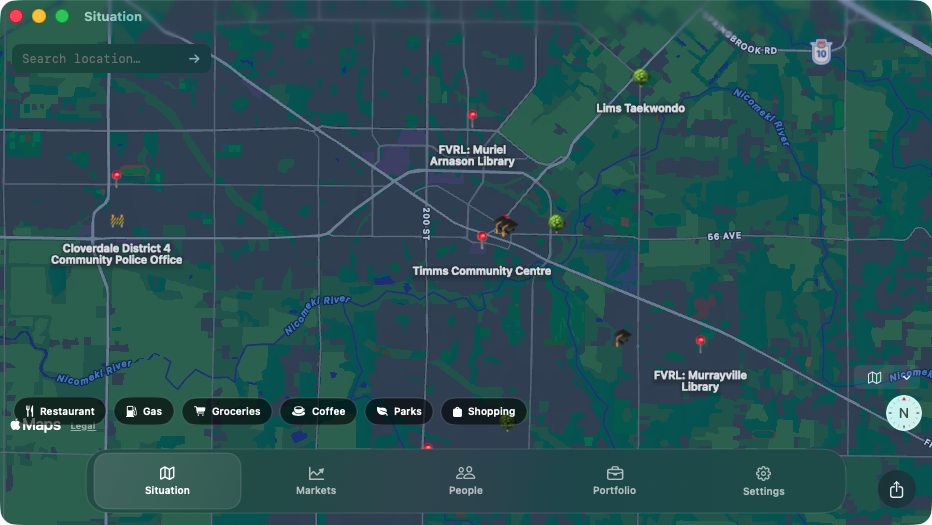
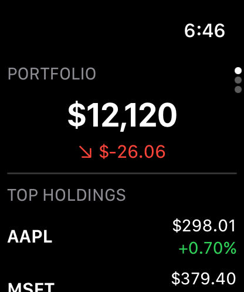
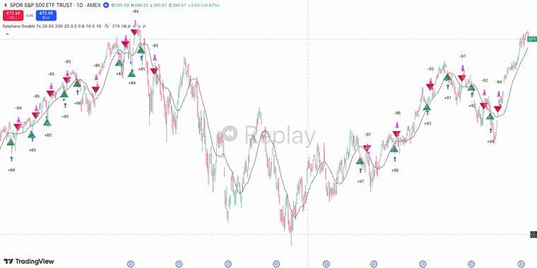

# Epiphany.
[](https://epiphany.heyitsmejosh.com) [](https://apps.apple.com/app/epiphany/id6779522175) [](https://apps.apple.com/app/epiphany/id6779522175) [](https://apps.apple.com/app/epiphany/id6779522175) [](LICENSE) [](https://github.com/nulljosh/epiphany) [](.claude/skills/epiphany/SKILL.md)

Everything happening in your world, on one screen. The map, the markets, the people. Palantir for regular people.

[Live](https://epiphany.heyitsmejosh.com) | [App Store](https://apps.apple.com/app/epiphany/id6779522175) | [Architecture](architecture.svg) | [Whitepaper](WHITEPAPER.md)

<p align="center">
  
  
  
  
</p>

<p align="center">
  
  
</p>


## Claude Skill

[`.claude/skills/epiphany`](.claude/skills/epiphany/SKILL.md) gives Claude Code admin access to your portfolio data in Upstash KV. Holdings, debt, budget. No app login:

```bash
scripts/kv-portfolio-edit.sh get <email>            # dump current portfolio JSON
scripts/kv-portfolio-edit.sh set <email> <file.json> # overwrite with merged JSON
```

## Tabs

| Tab | Status |
|---|---|
| Situation | Live map + daily brief + situation monitor + macro pulse |
| Markets | Stocks, crypto, commodities, fear/greed, Polymarket whales |
| Simulator | 60fps trading simulator with Kelly criterion and edge detection |
| Portfolio | Holdings, budgets, spending analysis |
| People | Search and index with relationship graph |
| Settings | Theme, ticker, account, billing |

## Features

- **Live Map.** 11 layers: flights, earthquakes, weather, wildfires, news, incidents, emergency services, dispatch, crime, local events, predictions
- **Daily Brief.** The morning in one card: top movers and headlines
- **Macro Pulse.** GDP, CPI, the Fed rate, yields, VIX, fear and greed, live
- **Markets.** Live quotes with bid, ask and exchange. 1m, 15m and max. Anomalies flagged
- **Indicators and Signal.** RSI, MACD, Bollinger, SMAs, Stochastic, ATR, and one Buy, Hold or Sell badge
- **Trading Simulator.** A 60 fps canvas with Kelly sizing and edge detection
- **Portfolio.** Holdings, net worth, where the money went
- **Prediction Markets.** Polymarket, with the whales tracked
- **Knowledge Graph.** 9 kinds of thing, 6 kinds of link
- **Command Bar.** Cmd+K, then type
- **Auth and Billing.** Free, or Premium at $1 a week through Stripe
- **Landing Page.** A node-graph hero, a ticker, features and pricing
- **PWA.** Works offline
- **Native.** iOS, macOS, Windows, Linux and Android

Roadmap: [roadmap.md](roadmap.md).

## Does the trading actually work?

We tested it on real history. Hundreds of stocks, index funds, Bitcoin, gold, oil, and the S&P 500 back to 1927. Each strategy was tuned on older years, then graded on newer years it had never seen. Like practising on old exams, then sitting a new one. Fees included.

One strategy passed. It's called Double 7s. When something that's been rising has its worst close in 10 days, buy. When it has its best close in 10 days, sell.



| Tested on | Trades that made money | Average gain per trade | Trades |
|---|---|---|---|
| 429 S&P 500 stocks | 67% | 0.39% | 22,614 |
| 16 index funds | 71% | 0.44% | 807 |
| Our TradingView watchlist, every symbol from its first day | 69% | 0.62% | 3,508 |
| Bitcoin | 71% | | 104 |

Two out of three trades make money, after fees, on years the strategy never saw. Only buying when fear is high (the VIX is spiking) lifts that to 73% on index funds. On the S&P 500 itself, graded on 49 years it never saw (1977 to now), the RSI(2) dip buy made money on 77% of trades.

What it won't do is beat buying and holding. We even tried parking the idle cash in SPY and only switching into dips: 8.8% a year against SPY's 15.1%. Most of those wins are just the market rising. It's in the market a few days at a time, so most of the year the cash sits still. Run as one account over index funds it grew about 2.7% a year, while just holding SPY grew 15%. TradingView's own Strategy Tester agrees on the win rate: 65% of 4,733 trades across our whole watchlist made money.

The full story, including everything that failed, is in [WHITEPAPER.md](WHITEPAPER.md#5-benchmark-does-it-work). Run it yourself: `python3 tradingview/backtest.py sp500`. The same strategies run live on a TradingView chart from `tradingview/epiphany.pine`.

## Setup

See [CLAUDE.md](CLAUDE.md) for dev, test, and build commands.

### Terminal dashboard

`npm run tui -- <email>` is a live portfolio dashboard in the terminal (ink). It reads Upstash KV directly. No login.

Deploy: Cloudflare Workers (`npm run deploy`)

## License

Apache 2.0, 2026, Joshua Trommel

## API and agent tools

An agent can drive this app. [`docs/API.md`](docs/API.md) lists the HTTP surface, where there
is one, and the WebMCP tools registered on `document.modelContext`. Tools come in three kinds:
read-only, writes you can undo, and the few that ask a human first.
