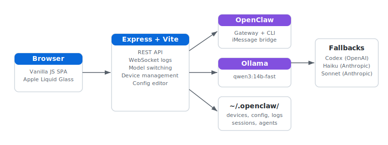

<div align="center">

# Dashboard


Developer dashboard for monitoring all projects in ~/Documents/Code/.

</div>


## Architecture



## What It Is

A local developer dashboard that auto-discovers every Git repo in `~/Documents/Code/` and shows live status: last commit time, dirty file count, GitHub Actions result, Vercel deployment state, and live URL links.

## Stack

- React + Vite
- Vite plugin exposes `/data.json` at runtime via `server/collect.js`
- No build-time data step  --  data refreshes on each request (60s cache)

## Usage

```bash
# Dev server  --  data collected live
npm run dev

# Production build
npm run build
```

## Status (2026-03-06)

- OpenClaw model controls are available in the dashboard UI.
- Curated model options are limited to latest Codex + Claude families.
- Default model target is `openai-codex/gpt-5.4-codex`.
- Public endpoint target: `dashboard.heyitsmejosh.com` (not yet deployed -- local dev only for now).

## Data Collection

`server/collect.js` scans every git repo in `~/Documents/Code/` and returns:

- Repo name, branch, last commit (ISO 8601), dirty file count
- GitHub Actions conclusion (via `gh` CLI)
- Vercel deployment state (via GitHub deployments API)
- Live URLs for deployed projects

Data is served at `/data.json` by the Vite dev plugin and at build time via the same module. A 60-second in-memory cache prevents hammering the GitHub API on every hot reload.

## Roadmap

- [ ] Live deploy status (Vercel webhook)
- [ ] Build log viewer
- [ ] Dependency audit alerts
- [ ] Git activity heatmap
- [ ] One-click redeploy

## Quick Commands
- `./scripts/simplify.sh` - normalize project structure
- `./scripts/monetize.sh . --write` - generate monetization plan (if available)
- `./scripts/audit.sh .` - run fast project audit (if available)
- `./scripts/ship.sh .` - run checks and ship (if available)
