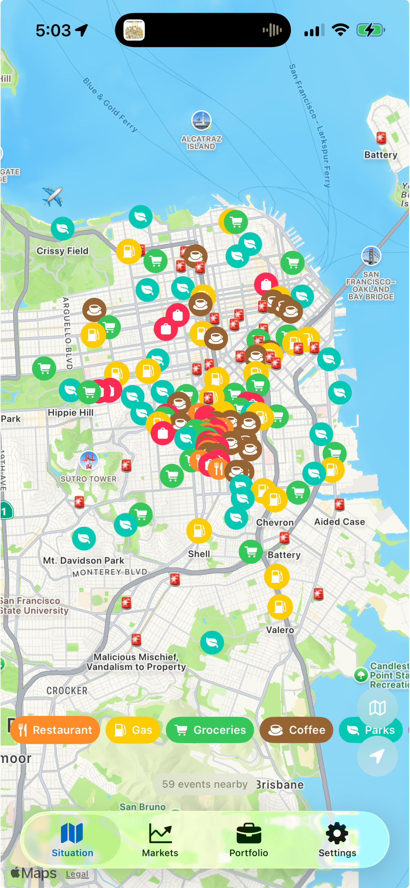
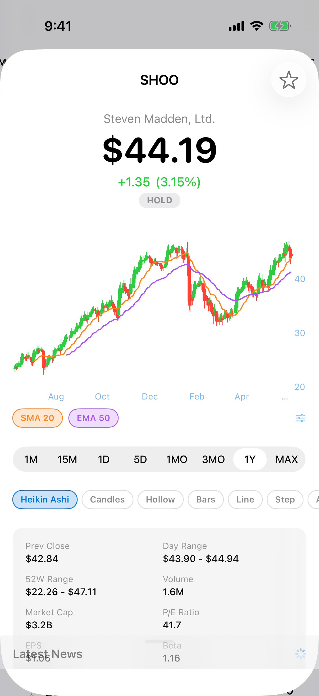
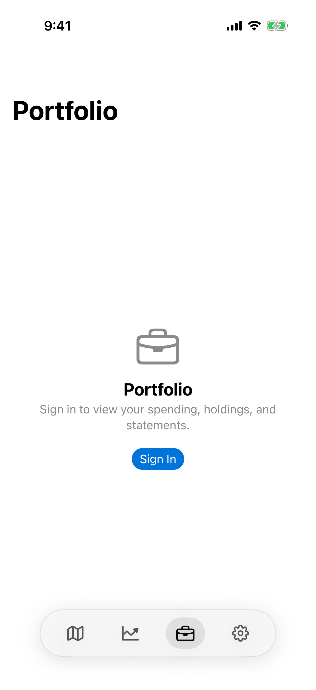
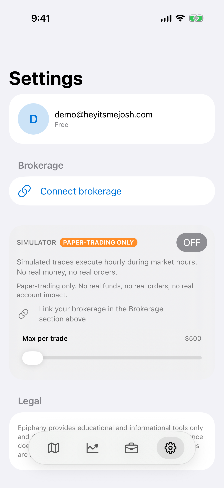

# Epiphany iOS


<p align="center">
  
  
  
  
  
</p>

Your personal intelligence layer. Epiphany watches everything happening around you — markets, events, weather, crime, traffic — and puts it all on one map. Think of it as having a friend who always knows what's going on.

## What it does

- **Situation** — MapKit map showing real-time data layers: flights, weather alerts, local events, crime, traffic, earthquakes, wildfires. Zoom in for venue details.
- **Markets** — Stocks, crypto, commodities with searchable list. Net worth, cash, debt timeline, daily brief, and market sentiment. Tap any asset for charts and fundamentals.
- **Portfolio** — Spending history, forecasts, holdings, budgeting, and debt/goals calendar with payoff dates.
- **Settings** — Profile (avatar, login), subscription tier, brokerage sync (Wealthsimple), Autopilot (BETA).

## What's ahead

- **Brokerage auto-sync** — login once, sync automatically in the background.
- **Portfolio analytics** — sophisticated projections, retirement planning, tax-loss harvesting.
- **Alerts** — price alerts for stocks, area alerts for weather/crime, custom event triggers.

## Run

```bash
xcodegen generate && open Epiphany.xcodeproj
# Build: Product → Run (⌘R)
# Test: Product → Test (⌘U)
# Simulator: iPhone 17 Pro (default in project.yml)
```

Backend: epiphany.heyitsmejosh.com (auth via email/password, credentials stored in keychain)

## Changelog

### v2.0.5 (2026-06-14)
- Stock detail sheet with technical indicators (Heikin Ashi, SMA/EMA, candles, fundamentals)
- Markets Fear & Greed sentiment display
- Improved portfolio allocation breakdown
- Settings brokerage sync UI refinements
- App Store screenshots updated (5 screens)

### v2.0.2 (2026-06-12)
- Epiphany branding (renamed from Monica)
- Portfolio view with spending forecast and debt calendar
- Brokerage sync (SnapTrade integration ready)
- SVG avatar support + web avatar fetch with rasterization
- Fear & Greed Index feed pill
- Dark mode refinements

### v2.0.0 (2026-05-30)
- Four-tab navigation (Situation, Markets, Portfolio, Settings)
- MapKit map (8 data layers: flights, weather, events, crime, traffic, earthquakes, wildfires, incidents)
- Real-time markets with portfolios and inline net worth
- Yahoo Finance fundamentals (market cap, P/E) via authenticated crumb flow
- Daily brief + news/macro/alerts feed
- Settings with avatar generator and Tally connection

### v1.3.1 (2026-03-28)
- Financial dashboard with debt projections, income timeline, and spending simulator
- Debt strategy charts (avalanche vs snowball vs do-nothing)
- Net worth projection and live projection with sliders
- Income phase timeline with status coloring

### v1.3.0 (2026-03-27)
- Dark app icon
- Wildfires via NASA EONET
- People search fixes
- Timezone bug fixes, filter mismatch fixes

### v1.2.0 (2026-03-26)
- Savings forecast and map density improvements
- Personal ontology layer
- Daily brief
- macOS sync
- PDF overhaul

### v1.1.0 – v1.3.1 (early 2026)
- People search with public profile aggregation
- AI intelligence analyst, portfolio analytics, income/debt forecasting
- Map data layers (crime, events, traffic, incidents)
- Stock detail sheets with fundamentals
- Tally integration, daily brief, macro indicators
- In-app news reader, sign in with Apple

## License

MIT 2026 Joshua Trommel

