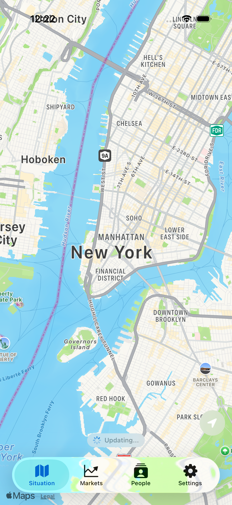

# Epiphany iOS


<p align="center"></p>

Your personal intelligence layer. Monica watches everything happening around you -- markets, events, weather, crime, traffic -- and puts it all on one map. Think of it as having a friend who always knows what's going on.


## What it does

- **Map** -- your home screen. Shows everything happening nearby: local events, construction, weather alerts, flights overhead, crime reports, traffic incidents. The more you zoom in, the more you see.
- **Markets** -- stocks, crypto, commodities, all in one list. Your portfolio summary sits at the top with a timeline showing when your debts get paid off and when payday hits. Tap any stock for charts, fundamentals, and related news.
- **People** -- search anyone by name and get a structured profile from public sources. Google aggregation, social discovery (LinkedIn, Facebook, X, Instagram, GitHub), public records. Profile cards with photo, bio, links, news mentions.
- **Settings** -- profile, subscription, map source toggles, Tally connection.

## Where it's going

Monica is becoming a full intelligence platform. The map is just the beginning.

- **More data, everywhere** -- gas stations with live prices, restaurant wait times, parking availability, public transit delays. If it's happening nearby, Monica should know about it.
- **Predictions** -- not just what's happening now, but what's about to happen. Event forecasting, price movement predictions, weather pattern analysis.
- **Alerts** -- price alerts for stocks, area alerts for crime/weather, custom triggers for anything Monica tracks.

Basically: Palantir for normal people.

## Run

```bash
# Open in Xcode, run on simulator or device.
# Backend env vars: FMP_API_KEY, FRED_API_KEY.
```

## Changelog

### v1.3.1 (2026-03-28)
- Financial dashboard with debt projections, income timeline, and spending simulator
- Debt strategy charts (avalanche vs snowball vs do-nothing)
- Net worth projection and live projection with sliders
- Income phase timeline with status coloring

### v1.3.0 (2026-03-27)
- Dark app icon
- Wildfires via NASA EONET
- People search fixes
- Timezone bug fixes, filter mismatch fixes

### v1.2.0 (2026-03-26)
- Savings forecast and map density improvements
- Personal ontology layer
- Daily brief
- macOS sync
- PDF overhaul

### v1.1.0 (2026-03-25)
- People tab (fourth tab)
- AI intelligence analyst
- Portfolio net worth + account balances inline
- Statements preload on launch

### v1.0.0 "Monica" (2026-03-25)
- Rebranded from Opticon to Monica
- New white app icon (Wealthsimple-inspired M + chart mark)
- Map events fix: local events now properly show on map (lng coordinate decode)
- Added Ticketmaster as event source, improved OSM venue queries
- Better incident data: construction, emergency services, police stations instead of random bollards
- Stock detail: market cap, P/E, EPS now show via FMP profile fallback
- Related news: smarter matching with company name aliases (Apple for AAPL, etc.)
- Profile name: set and change your display name in settings
- Markets performance: deferred heavy loads, market data renders first
- Error handling: map errors auto-dismiss after 5 seconds

### Pre-rebrand (Opticon)

### v4.0.0 "Snow Leopard" (2026-03-25)
- Three tabs (Map, Markets, Settings), removed standalone Portfolio tab
- Portfolio data merged into Markets as collapsible section
- In-app news reader via SFSafariViewController
- Map is the default home screen

### v3.1.0 (2026-03-24)
- Map: crime, local events, traffic data layers
- Stock detail: company name in header
- Tally: hardened error handling

### v3.0.0 (2026-03-21)
- Sign in with Apple, clrs.cc palette, security hardening

### v2.10.0 (2026-03-21)
- Polymarket, FRED macro indicators, news aggregation

### v2.7.0 (2026-03-21)
- Trading simulator with Kelly criterion

## License

MIT 2026 Joshua Trommel
