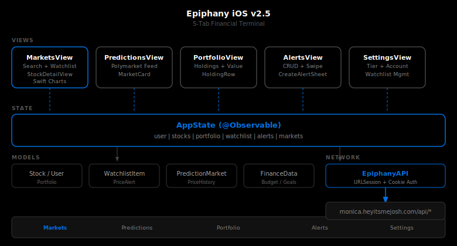

# Opticon iOS


iPhone companion for Opticon. Five tabs: Portfolio, Markets, Map, Simulator, Settings.


## Features

- Six-tab layout: Portfolio, Markets, Map, Simulator, Polymarket, Settings
- Trading simulator with 61 assets, Kelly sizing, $10T win condition with confetti
- Spending forecast with Monte Carlo predictions
- Stock details with company name, 10 data fields (P/E, market cap, EPS, day/52W ranges), related news
- Map with 7 data layers: earthquakes, flights, incidents, weather alerts, crime, local events, traffic
- Equity curve chart with downsampling for performance
- Tally integration with hardened error handling

## Run

```bash
# Open in Xcode, run on simulator or device.
# Some screens need backend env vars: FMP_API_KEY, FRED_API_KEY.
```

## Roadmap

### v2.12 -- Push + Notifications
- [ ] APNs registration + device token storage
- [ ] Push notifications for price alerts (above/below triggers)
- [ ] Background app refresh for portfolio updates

### v2.13 -- Map Enrichment
- [ ] Weather alert annotations with lat/lon coordinates
- [ ] Flight path rendering on map
- [ ] Incident clustering for dense areas

### v2.14 -- StoreKit 2
- [ ] In-app subscription management (Free/Pro/Ultra)
- [ ] Receipt validation + entitlement checks
- [ ] Replace web upgrade redirect with native flow

### v2.15 -- Widgets + Live Activities
- [ ] Portfolio summary widget (small/medium)
- [ ] Stock watchlist widget
- [ ] Live Activity for active simulator runs

### v2.16 -- Offline + Performance
- [ ] Offline caching for market data (SwiftData)
- [ ] Image caching for avatars and stock logos
- [ ] Lazy loading for large portfolio lists

### v2.17 -- macOS Parity
- [ ] Sync feature set with opticon-macos
- [ ] Shared Swift package for models + API layer

### Backlog
- [ ] Consolidate currency formatters into shared utility
- [ ] Achievement toast race condition fix
- [ ] FRED macro fallback data fix (0% change display)

## Changelog

### v3.1.0 (2026-03-24)
- Map: 3 new data layers (crime, local events, traffic) with Settings toggles
- Stock detail: company name display in header
- Tally: hardened error handling (timeouts, auth failures, server errors)
- Security: TallyService session timeouts, proper error types

### v3.0.0 (2026-03-21)
- Sign in with Apple authentication with account linking
- clrs.cc color palette across all views
- Security hardening: keychain access control, tally error surfacing
- Removed dead code (paydayCard), code review fixes
- Comprehensive roadmap in README

### v2.10.0 (2026-03-21)
- Polymarket prediction markets tab
- Macro indicators view (FRED data)
- News aggregation with 2-minute cache

### v2.7.0 (2026-03-21)
- Trading simulator: 61-asset Monte Carlo engine ported from web
- Kelly criterion position sizing, 6-stage entry filters, trailing stops
- SimulatorView: equity curve chart, live balance, position tracking, speed control
- New Simulator tab (6 tabs total)

### v2.6.0 (2026-03-21)
- Tally integration: next payday countdown card on Portfolio tab
- BounceButtonStyle: spring press effect with haptics on all interactive elements
- Map: error banner with retry button, event count indicator, empty state guidance
- Spring animation on category selection toggle

### v2.5.1 (2026-03-21)
- Fix: spending forecast line no longer deforms on drag interaction
- Fix: removed duplicate X axis month labels on spending chart
- Fix: simulator destination updated to iPhone 17 Pro

### v2.4.0 (2026-03-21)
- Interactive spending chart with drag selection; portfolio tab consolidation
- Map zoom fix; dark icon redesign
- Forgot password flow; backend statement transaction fix

## License

MIT 2026 Joshua Trommel
