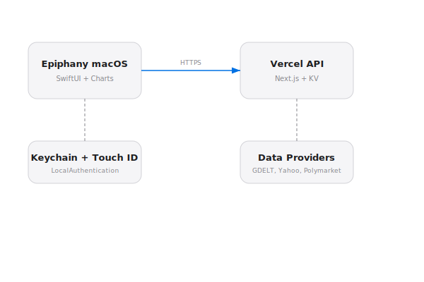

# Opticon macOS


Native macOS companion for Opticon. MapKit map, markets table, predictions, portfolio, trading simulator, alerts. Pure SwiftUI, macOS 14+.
[Opticon](https://opticon.heyitsmejosh.com) | 

## Features
- MapKit map with 7 data layers (earthquakes, flights, incidents, weather, crime, local events, traffic)
- Chart scrub with crosshair on stock detail
- 2-column stats grid (Open, Prev Close, Day Range, 52W Range, Volume, Market Cap, P/E, EPS)
- Related news on stock detail
- Markets table
- Predictions
- Portfolio
- Alerts
- Tally integration
- Pure SwiftUI
- macOS 14+

## Run
```bash
xcodegen generate
xcodebuild -project Opticon.xcodeproj -scheme Opticon -destination 'platform=macOS' build
```

## Roadmap
- [ ] Notification Center integration for price alerts
- [ ] Widgets (map snapshot, portfolio summary)
- [ ] Menu bar quick-glance ticker

## Changelog
### v0.5.0 (2026-03-24)
- Chart scrub with crosshair, dashed rule mark, and point mark on stock detail
- Company name below symbol in stock detail header
- 2-column stats grid replacing old infoRow layout
- Related news section on stock detail
- Crime, local events, and traffic map layers with annotations
- New map source toggles in settings (7 total)
- Tally service integration (keychain credentials, payment info)
- Removed SoundManager

### v0.3.0 (2026-03-21)
- Map zoom fix (2.2 -> 0.08)
- Map stays steady on load or state changes

### v0.2.0
- Initial release with map, markets, predictions, portfolio, alerts

## License
MIT 2026 Joshua Trommel
