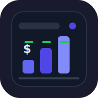

# UsageLedger


Local-first iOS app for tracking LLM usage across providers, models, projects, and sessions.

## Features

- Log usage entries with provider, model, token counts, and cost
- Organize by project and session
- Dashboard with total entries, cost, and token summaries
- Supports OpenAI, Anthropic, Google, Ollama, and custom providers
- SwiftData persistence (no backend required)

## Stack

- SwiftUI + SwiftData
- iOS 17+
- xcodegen for project generation

## Development

```bash
xcodegen generate && open UsageLedger.xcodeproj
```

## License

MIT 2026, Joshua Trommel
